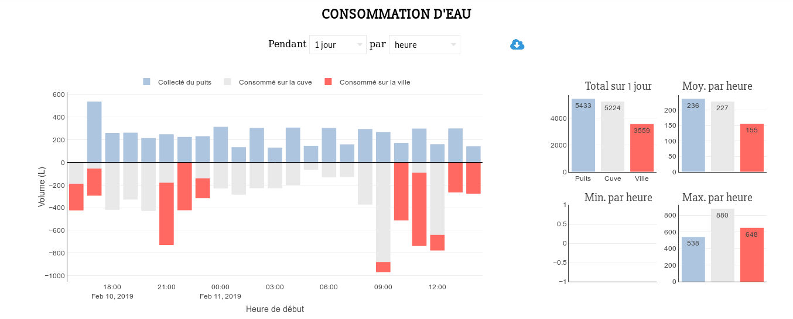
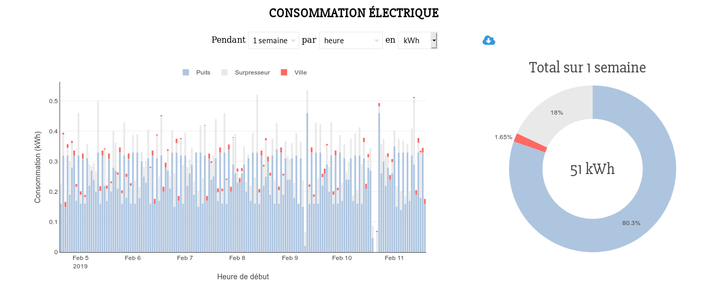
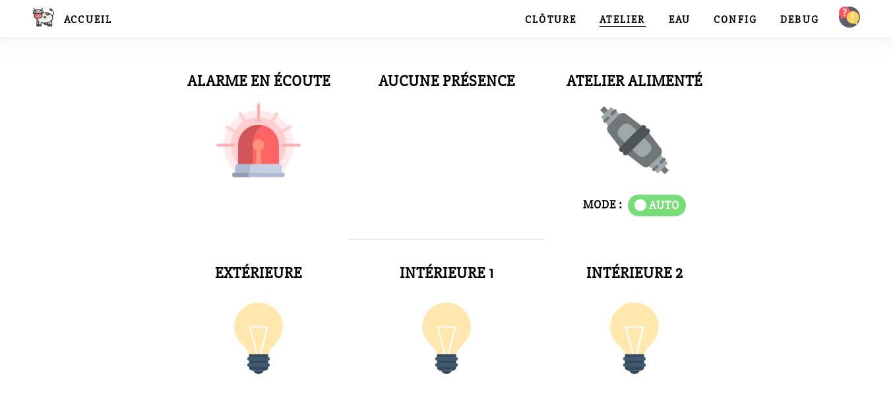

# Atelier

This is a personal project with my uncle farmer (Normandy, France) that consists in
using domotics to automate tasks in his farm. The main features are:

* Breach detection
* Automatic light control
* Water system control with pumps (getting water from a well into a tank)
* Water consumption statistics
* SMS alerts

The project is made of a [Controllino](https://www.controllino.biz/) (based on Arduino) to read the
sensors and control the physical system (lights, pumps...) and of a Raspberry Pi
that hosts a web interface (in Python) and a database.
They communicate through Ethernet.

Here are some pictures of the interface (in French) and of the system. More of them are in
`docs/photos` and `docs/screenshots`.

______

______

______

______

______

## Usage

See `docs/dev.md` and `docs/deploy.md`.

## Credits

Icons made by [Freepik](https://www.flaticon.com/authors/freepik) (CC 3.0 BY).
